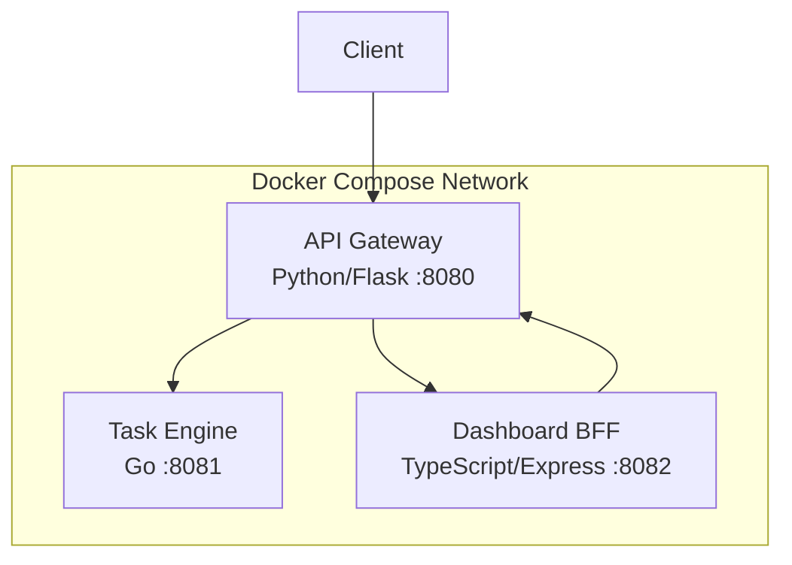

# NexusFlow

A microservice-based task orchestration platform built with Python, Go, and TypeScript.

## Architecture



### Services

| Service | Language | Port | Description |
|---------|----------|------|-------------|
| **Gateway** | Python (Flask) | 8080 | API gateway that routes requests and aggregates service status |
| **Engine** | Go | 8081 | Core task engine with in-memory CRUD operations |
| **Dashboard** | TypeScript (Express) | 8082 | Backend-for-Frontend that provides task summaries and proxied views |

## Quick Start

### Prerequisites

- Docker and Docker Compose
- (For local dev) Python 3.12+, Go 1.22+, Node.js 20+

### Run with Docker Compose

```bash
cp .env.example .env
make up
```

### Run Locally

```bash
# Terminal 1: Engine
cd engine && go run .

# Terminal 2: Gateway
cd gateway && pip install -r requirements.txt && python app.py

# Terminal 3: Dashboard
cd dashboard && npm install && npm run dev
```

## API Reference

### Gateway (port 8080)

| Method | Endpoint | Description |
|--------|----------|-------------|
| GET | `/health` | Health check |
| GET | `/api/tasks` | List all tasks |
| POST | `/api/tasks` | Create a task (`{"name": "...", "description": "..."}`) |
| GET | `/api/tasks/:id` | Get a task by ID |
| DELETE | `/api/tasks/:id` | Delete a task |
| GET | `/api/status` | Aggregated system status |

### Engine (port 8081)

| Method | Endpoint | Description |
|--------|----------|-------------|
| GET | `/health` | Health check |
| GET | `/tasks` | List all tasks |
| POST | `/tasks` | Create a task |
| GET | `/tasks/:id` | Get a task by ID |
| DELETE | `/tasks/:id` | Delete a task |

### Dashboard BFF (port 8082)

| Method | Endpoint | Description |
|--------|----------|-------------|
| GET | `/health` | Health check |
| GET | `/dashboard/summary` | Task count summary (total, pending, completed) |
| GET | `/dashboard/tasks` | Proxied task list |
| GET | `/dashboard/status` | Proxied system status |

## Usage Examples

```bash
# Create a task
curl -X POST http://localhost:8080/api/tasks \
  -H "Content-Type: application/json" \
  -d '{"name": "Deploy v2", "description": "Deploy version 2 to production"}'

# List tasks
curl http://localhost:8080/api/tasks

# Get dashboard summary
curl http://localhost:8082/dashboard/summary

# Check system health
curl http://localhost:8080/api/status
```

## Testing

```bash
# Run all tests
make test

# Run individual service tests
make test-python
make test-go
make test-ts

# Lint
make lint
```

## Makefile Commands

| Command | Description |
|---------|-------------|
| `make test` | Run all tests |
| `make lint` | Run all linters |
| `make build` | Build Docker images |
| `make up` | Start all services |
| `make down` | Stop all services |
| `make logs` | Tail service logs |
| `make clean` | Remove containers, images, and build artifacts |

## Environment Variables

See [`.env.example`](.env.example) for all configuration options.

## CI/CD

GitHub Actions workflow runs on push/PR to `main`:
1. Python tests + flake8 lint
2. Go tests
3. TypeScript tests + ESLint
4. Docker Compose build verification

> **Note:** The `.github/workflows/ci.yml` file may need to be manually added after initial repository setup due to GitHub API restrictions.

### CI Workflow Content

```yaml
name: CI

on:
  push:
    branches: [main]
  pull_request:
    branches: [main]

jobs:
  test-python:
    runs-on: ubuntu-latest
    defaults:
      run:
        working-directory: gateway
    steps:
      - uses: actions/checkout@v4
      - uses: actions/setup-python@v5
        with:
          python-version: "3.12"
      - run: pip install -r requirements.txt
      - run: flake8 app.py test_app.py --max-line-length=120
      - run: pytest -v

  test-go:
    runs-on: ubuntu-latest
    defaults:
      run:
        working-directory: engine
    steps:
      - uses: actions/checkout@v4
      - uses: actions/setup-go@v5
        with:
          go-version: "1.22"
      - run: go test -v ./...

  test-typescript:
    runs-on: ubuntu-latest
    defaults:
      run:
        working-directory: dashboard
    steps:
      - uses: actions/checkout@v4
      - uses: actions/setup-node@v4
        with:
          node-version: "20"
      - run: npm install
      - run: npx eslint src/
      - run: npm test

  docker-build:
    runs-on: ubuntu-latest
    needs: [test-python, test-go, test-typescript]
    steps:
      - uses: actions/checkout@v4
      - run: docker compose build
```
